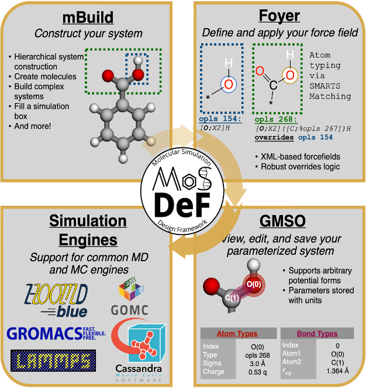

# cecam-mosdef-workshops
Workshops for the [Molecular Simulation and Design Framework (MoSDeF)](https://mosdef.org/). MoSDeF is a suite of open-source Python tools that enable extensible and reproducible molecular simulations. 

MoSDeF includes: [mBuild](https://github.com/mosdef-hub/mbuild) | [GMSO](https://github.com/mosdef-hub/gmso.git) | [Foyer](https://github.com/mosdef-hub/foyer.git)
<p align="center">
  
</p>

# How run these tutorials:

## Use binder:
Click: [](https://mybinder.org/v2/gh/chrisjonesBSU/cecam-mosdef-workshops/main)   

This launches a remotely-hosted Jupyter Notebook instance with everything ready-to-go. This is recommended for anyone on a Windows machine, or anyone who does not already have the anaconda package manager installed. Although, you can use this link regardless.


## Use Locally:
If you are on a MacOS or Linux machine, and already have the anaconda package manager installed, you can choose to build the environment and run the notebooks locally. It is possible that the notebooks run faster locally than using Binder. If you are on Windows and want to use run these locally, you will have to run the commands below within Windows Subsystem for Linux (WSL).

In your terminal run:

```bash
git clone git@github.com:chrisjonesBSU/cecam-mosdef-workshops.git
cd cecam-mosdef-workshops
conda env create -f environment.yml
conda activate mosdef
cd notebooks
jupyter lab
```

**Note:** The git clone command above works if you have an SSH key set up. If not you can clone with HTTPS:

`git clone https://github.com/chrisjonesBSU/cecam-mosdef-workshops.git`

This may prompt you for your GitHub login information.

---

# Beyond The Workshop:

**Using MoSDeF:** All three packages are available on conda forge:

`conda create -n mosdef -c conda-forge mbuild foyer gmso`

The documentatin for each package is available on their repositories.

**Issues, questions and contributions are welcome!** Visit the GitHub repositories and open an issue with any question or technical barriers you are facing. Open a pull-request to make upstream contributions. If you would like to discuss in more detail over email, please send an email to **c.jones_1@hw.ac.uk**.

**GitHub Repos:** [mBuild](https://github.com/mosdef-hub/mbuild) | [GMSO](https://github.com/mosdef-hub/gmso.git) | [Foyer](https://github.com/mosdef-hub/foyer.git)
